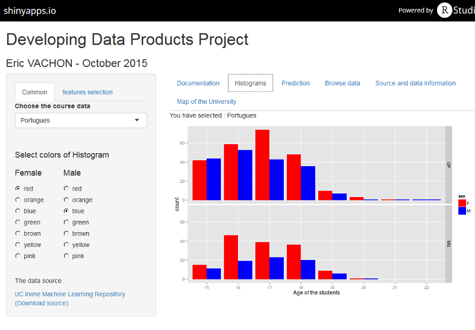

<!--
library(slidify)
setwd("D:\\_MOOC_\\git\\Developing_Data_Products")
publish(title = 'Developing Data Products Project', 'index.html', host = 'rpubs') 
-->

## Aim of the project
hihihi

--- .class #id 

## Histogram screen


--- .class #id  

## Prediction
```{r, echo = FALSE}
set.seed(12345)
suppressPackageStartupMessages(library(RCurl))
suppressPackageStartupMessages(library(ggplot2))
suppressPackageStartupMessages(library(caret))

loadCSV <- function(URL) {
  csv <- tryCatch( {read.csv(text=getURL(URL,ssl.verifypeer=0L, followlocation=1L),sep=';')},
                          error=function(cond) {return(read.csv(URL,sep=';'))})    
  return(csv)
}
studentData       <- loadCSV("https://raw.githubusercontent.com/ervachon/Developing_Data_Products/gh-pages/student/student-por.csv")
inTrain           <- createDataPartition(y=studentData$G3, p=.8, list = FALSE)
ourTrain          <- studentData[inTrain,];
ourTest           <- studentData[-inTrain,]
modelFit          <- train(as.formula(G3 ~ . ), method = "glm",data=ourTrain)
testPred          <- predict(modelFit,ourTest)
results           <- cbind(ourTest$G3,testPred)
colnames(results) <- c("Reference", "Prediction")
results           <- as.data.frame(results)
```
```{r, message=FALSE, warning=FALSE, fig.width=8, fig.height=6}
ggplot(results, aes(x = Reference, y = Prediction)) + geom_point(color='blue') + 
    geom_abline(intercept=0,slope=1,colour='red') + geom_smooth(color = 'green')
```

--- .class #id  
## Links and ressources

[The Shiny App is here :-)](https://ervachon.shinyapps.io/Developing_Data_Products)  
[The RPubs 5-slides is here :-)](http://rpubs.com/ervachon/117127)  
[This HTML  5-slides is here :-)](http://ervachon.github.io/Developing_Data_Products/)  
  
 
