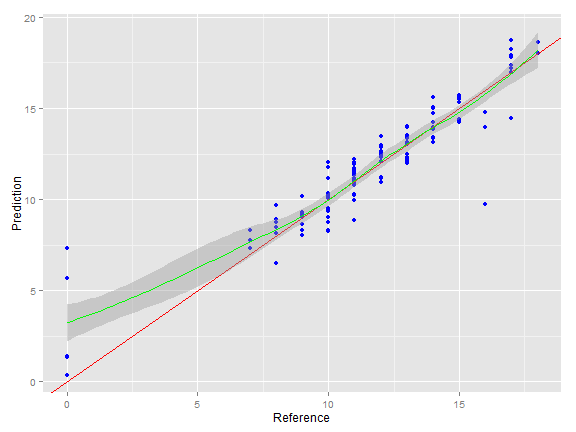
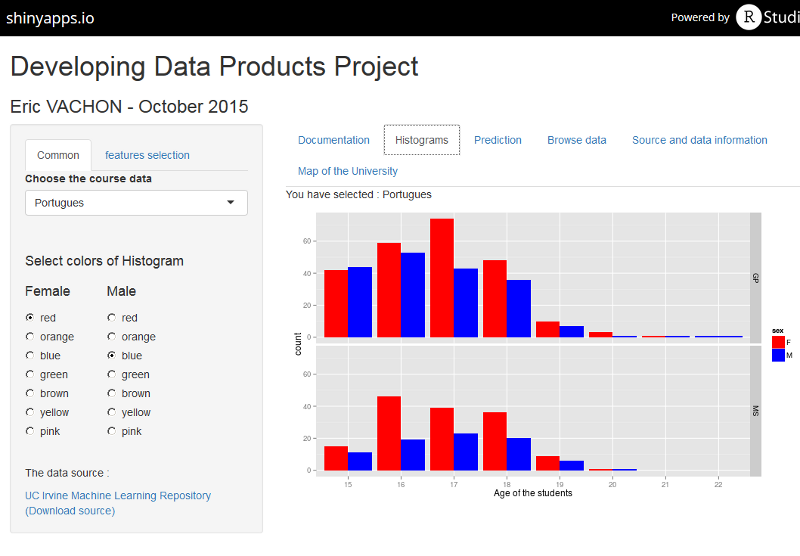

---
title       : Developing Data Products Project
subtitle    : Part of the coursera Data Science Specialization
author      : Eric VACHON
job         : October 2015
logo        : logo.jpg
framework   : io2012   # {io2012, html5slides, shower, dzslides, deckjs...}
widgets     : [bootstrap,quiz]   # {mathjax, quiz, bootstrap}
mode        : selfcontained # {standalone, draft}
knit        : slidify::knit2slides
--- 
<!--
library(slidify)
setwd("D:\\_GIT_\\Developing_Data_Products")
setwd("D:\\_MOOC_\\git\\Developing_Data_Products")
publish(title = 'Developing Data Products Project', 'index.html', host = 'rpubs') 
-->

## Aim of the project
<br>
The aim of [this project](https://ervachon.shinyapps.io/Developing_Data_Products)   is to use the [portugues data students](http://www3.dsi.uminho.pt/pcortez/student.pdf) to predict student performance in secondary education (high school).  
<br>
We developpe a [Shiny application](https://ervachon.shinyapps.io/Developing_Data_Products) to help the data mining : select features and predict the grade.  
<br>
We also purpose tools to modify the color of the data histograms.  
<br>

--- .class #id 

## Prediction


```r
ggplot(results, aes(x = Reference, y = Prediction)) + geom_point(color='blue') + 
        geom_abline(intercept=0,slope=1,colour='red') + geom_smooth(color = 'green')
```

 

--- .class #id  

## Histograms screen


--- .class #id  

## Links

### My URL
- [My Shiny App is here](https://ervachon.shinyapps.io/Developing_Data_Products)  
- [My Github](https://github.com/ervachon/Developing_Data_Products)  
<br>

### Source  
- Data can be download [UC Irvine Machine Learning Repository](https://archive.ics.uci.edu/ml/datasets/Student+Performance)
- Data came from [Paulo Cortez, University of Minho, Guimarães, Portugal](http://www3.dsi.uminho.pt/pcortez)
- Relevant Papers [P. Cortez and A. Silva. Using Data Mining to Predict Secondary School Student Performance. In A. Brito and J. Teixeira Eds., Proceedings of 5th FUture BUsiness TEChnology Conference (FUBUTEC 2008) pp. 5-12, Porto, Portugal, April, 2008, EUROSIS, ISBN 978-9077381-39-7.](http://www3.dsi.uminho.pt/pcortez/student.pdf)
