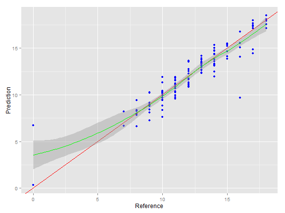

<!--
library(slidify)
setwd("D:\\_MOOC_\\git\\Developing_Data_Products")
publish(title = 'Developing Data Products Project', 'index.html', host = 'rpubs') 
-->

## Aim of the project
hihihi

--- .class #id 

## Histogram screen


--- .class #id  

## Prediction


```r
ggplot(results, aes(x = Reference, y = Prediction)) + geom_point(color='blue') + 
    geom_abline(intercept=0,slope=1,colour='red') + geom_smooth(color = 'green')
```

 

--- .class #id  
## Links and ressources

[The Shiny App is here :-)](https://ervachon.shinyapps.io/Developing_Data_Products)  
[The RPubs 5-slides is here :-)](http://rpubs.com/ervachon/117127)  
[This HTML  5-slides is here :-)](http://ervachon.github.io/Developing_Data_Products/)  
  
 
